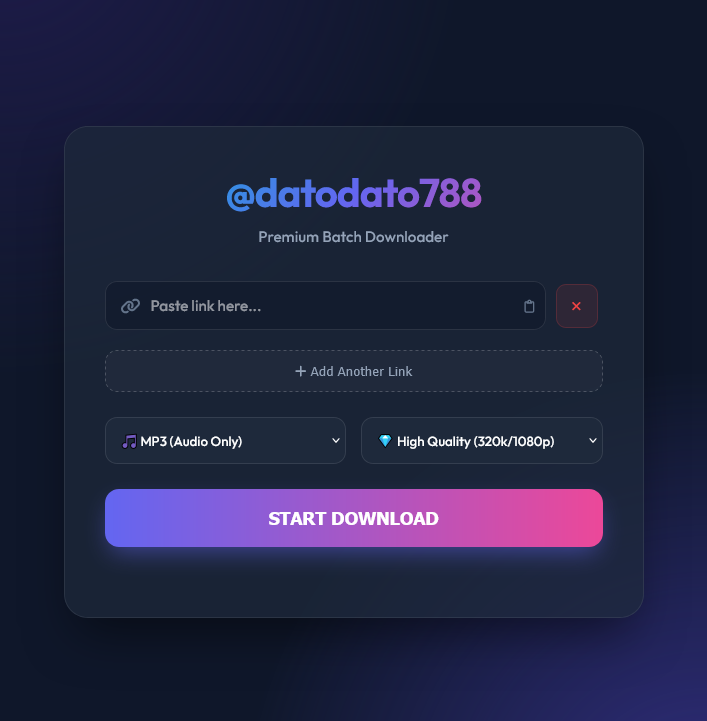

<p align="center">
  
</p><br> 

# 🎥 Video & Music Downloader
A powerful and simple tool designed to download media content from various platforms across the internet.

## ✨ Features
- **Universal Support:** Download video or audio from almost any website (YouTube, Facebook, Instagram, TikTok, Twitter, etc.).
- **High Quality:** Supports the best available quality for both video and audio formats.
- **Easy to Use:** Simple interface—just paste the link and click download.
- **Fast Conversion:** Quickly converts videos to MP3 or MP4 formats.

## 🚀 How to use (Binary)
1. Go to the **Releases** section.
2. Download the latest `.exe` file.
3. Run the application, paste your link, and enjoy!

---

## 🛠 Installation for Developers (Running from Source)

If you prefer to run the script directly using Python, follow these steps:

### 1. Clone the repository
```bash
git clone https://github.com/datodato788/Video-Music_downloader.git
cd Video-Music_downloader
```
### 2. Set up a Virtual Environment (Recommended)
On Windows:
```bash
# Create virtual environment
python -m venv venv

# Activate virtual environment
venv\Scripts\activate
```
On Linux / macOS:
```bash
# Create virtual environment
python3 -m venv venv

# Activate virtual environment
source venv/bin/activate
```
### 3. Install Dependencies
```bash
pip install -r requirements.txt
```

Make sure you are in the virtual environment, then run:
```bash
python main.py
```

## 📝 Note for Linux Users

Make sure you have ffmpeg installed on your system for media conversion:
```bash
sudo apt update && sudo apt install ffmpeg
```
